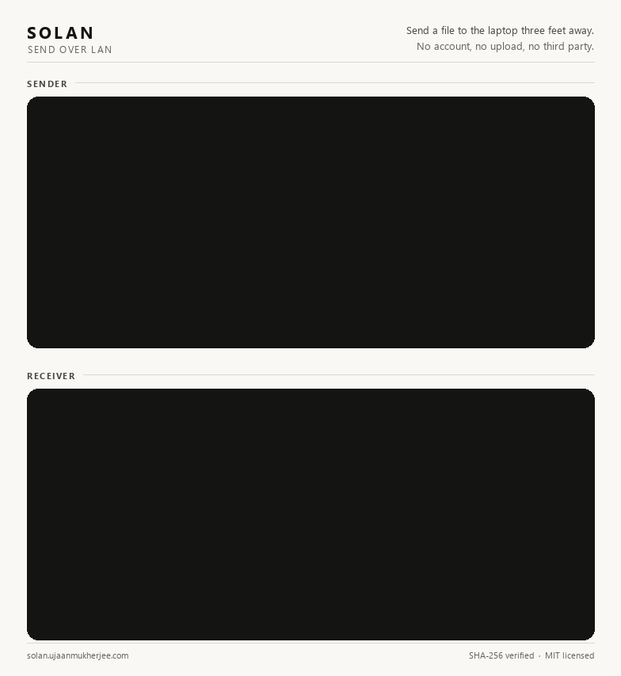

# SOLAN, Send Over LAN

A command line tool for sending files directly between two computers on the same local network. No cloud storage, no third party server, no account needed. One computer listens, the other one connects and sends. That's it.



*A real 500 MB transfer, both ends at once: the sender discovers the receiver on the LAN, the receiver is asked before anything touches its disk, and both keep a verified record when it lands.*

This project started as a way to actually learn C++ properly. Not competitive programming or algorithm puzzles, but the real, practical stuff that tutorials usually skip: how to set up CMake, how to manage third party libraries without a package manager, how to get a project building the same way on both Windows and Linux, and how to structure a codebase so it doesn't fall apart as it grows.

## What it can do

**Direct file transfer over TCP**
Send a file straight from one machine to another. No middleman, no upload step.

**Automatic peer discovery**
Finds other SOLAN instances on the network via UDP broadcast. No need to type IP addresses by hand.

**Interactive shell**
Run `solan` with no arguments for a small interactive shell, similar in spirit to the MongoDB shell.

**Integrity verification**
Every file is hashed with SHA-256 on send and re-checked on arrival. A mismatch gets discarded automatically.

**Safe writes**
Incoming files write to a temporary file first, renamed only after the hash check passes. No broken partial files left behind.

**Accept or reject transfers**
You get a prompt before any file bytes are transferred, not after.

**Persistent receive mode**
The receiver keeps listening after each file, handling transfer after transfer in one session.

**Live progress bar**
Both sending and receiving show progress as it happens.

**Cross platform**
Builds and runs on Windows and Linux, verified on every push via GitHub Actions on both `ubuntu-latest` and `windows-latest`.

**Multi-file transfers**
Send more than one file at a time. SOLAN packs a batch into a single zip archive before sending. A lone file is sent as itself, so it keeps its own name and skips the packing step entirely.

## Requirements

- CMake 3.20 or newer
- A C++17 compiler (MSVC on Windows, GCC on Linux)
- Ninja is recommended as the build generator
- An internet connection the first time you build, since dependencies (standalone Asio and PicoSHA2) are downloaded automatically through CMake's `FetchContent`. You don't need to install them yourself.

## Building it

```bash
git clone https://github.com/KireinaR/solan.git
cd solan
cmake -B build -S . -G Ninja -DCMAKE_BUILD_TYPE=Debug
cmake --build build
```

On Windows, run these commands from a "Developer PowerShell for VS 2026" (or whichever Visual Studio version you have) so the compiler is properly set up on your PATH.

## Using it

### The interactive shell

Just run the executable with no arguments:

```bash
./solan
```

You'll land in a small shell that looks something like this:

```
  S O L A N                                                       v0.1.0
  Send Over LAN

  ──────────────────────────────────────────────────────────────────────

  Send a file to the laptop three feet away.
  Two machines, one socket, no middleman.

  help  commands     exit  quit

  solan >>
```

From here, `help` shows you the available commands at any point, and `sm <mode>` switches between the two modes:

- `sm receive` puts you in receive mode, where SOLAN starts listening for incoming files and broadcasting its presence on the network so other SOLAN instances can find it.
- `sm send` puts you in send mode, where you can discover peers and send them files.

**A typical receiving session:**

```
  solan >> sm receive

  ──────────────────────────────────────────────────────────────────────

  RECEIVE MODE

  Ctrl+C   force-quit while idle
  exmo     leave, offered after each transfer

  ⠹  Listening on 192.168.1.12:48562
```

Once a sender shows up, you get asked before anything touches your disk:

```
  Incoming from 192.168.1.39

  PAYLOAD                                                           SIZE
  ──────────────────────────────────────────────────────────────────────
  photo.png                                                      2.4 MB

  Accept this transfer?  (y) accept   (n) reject
  >> y

  ┄┄⇠ Receiving photo.png (2.4 MB)

  ██████████████████████████████░░░░░░░░░░░░░░░░░░░░░░░░░░░░░░░  50.12%
  1.2 MB / 2.4 MB  ·  8.1 MB/s                              1s remaining
```


**A typical sending session:**

```
  solan >> sm send

  ──────────────────────────────────────────────────────────────────────

  SEND MODE

  Type help for commands, back to return.

  solan send >> discover

  ⠼  Scanning the local network for peers
```

```
  Found 1 peer

  #    HOST                                                   ADDRESS
  ──────────────────────────────────────────────────────────────────────
  1    DESKTOP-JAKE                                      192.168.1.12

  Send with send <n> <file> ..., using the # column.

  solan send >> send 1 photo.png
```

The payload is listed, offered, and then sent — each stage with its own
spinner. One file goes as itself, so there is no packing step:

```
  FILE                                                              SIZE
  ──────────────────────────────────────────────────────────────────────
  photo.png                                                       2.4 MB

  Connected to 192.168.1.12:48562
  ⠧  Awaiting receiver, ready to send photo.png (2.4 MB)
  Receiver accepted

  ┄⇢┄ Sending photo.png (2.4 MB)

  ██████████████████████████████░░░░░░░░░░░░░░░░░░░░░░░░░░░░░░░  50.12%
  1.2 MB / 2.4 MB  ·  8.1 MB/s                              1s remaining
```


Hand it more than one file and it packs them first:

```
  solan send >> send 1 photo.png notes.txt

  ┄ ┄ Compressing 2 objects (2.6 MB), preparing to send
  Compressed 2 objects (2.5 MB)
  ...
  Sent 2 objects, zipped, SHA-256 attached
```

```
  solan send >> back
  solan >> exit

  bye.
```

### Direct command line mode

If you'd rather script it or skip the interactive shell entirely, SOLAN also accepts arguments directly:

```bash
# Start a receiver on the default port
./solan server

# Send a file to a specific IP address
./solan client <ip-address> <path-to-file>

# Several files at once, packed into one archive
./solan client <ip-address> <file-1> <file-2> ...
```

This is the same underlying logic as the shell, just without the menu.

## How the transfer actually works

SOLAN uses a small custom protocol over a single TCP connection.

1. The client connects to the server.
2. The client sends the length of the filename, then the filename itself.
3. The client sends the file size, as an 8 byte number.
4. The server reads all of that, then asks the person running it whether to accept the transfer, and sends back a single byte saying yes or no.
5. If accepted, the client streams the file in small chunks, hashing each chunk with SHA-256 as it goes, and the server writes those chunks to a temporary file while computing its own hash in parallel.
6. Once the file is fully sent, the client sends its final hash.
7. The server compares the two hashes. If they match, the temporary file is renamed to its final name. If they don't, the temporary file is deleted and the transfer is reported as failed.

A single file travels as itself, under its own name. Two or more are zipped into one archive first, which the receiver saves as `received_solan_transfer.zip`.

Peer discovery works separately, over UDP. A machine in receive mode periodically broadcasts a small message containing its hostname and port. Machines in send mode listen for these broadcasts for a few seconds and build a list of who responded.

## Project layout

Three layers: `app` drives the session, `net` moves the bytes, `ui` draws the
terminal. Headers are included root-relative from `src/`, so a file's include
list reads as its dependency list.

```
solan/
├── src/
│   ├── main.cpp              entry point: shell, or direct CLI mode
│   ├── app/
│   │   ├── shell.h/.cpp       the interactive shell (REPL + dispatch)
│   │   ├── screens.h/.cpp     banner, help screens, prompts, peer list
│   │   └── transfer.h/.cpp    the send and receive flows
│   ├── net/
│   │   ├── protocol.h         shared constants (ports, chunk size, etc.)
│   │   ├── sender.h/.cpp      client side logic
│   │   ├── receiver.h/.cpp    server side logic
│   │   ├── discovery.h/.cpp   UDP broadcast and peer discovery
│   │   └── archive.h/.cpp     zipping and payload sizing
│   └── ui/
│       ├── terminal.h/.cpp    ANSI support, width, TTY detection
│       ├── theme.h/.cpp       palette and text styles
│       ├── text.h/.cpp        byte/duration formatting, width measurement
│       ├── layout.h/.cpp      margins, hairlines, rows, status lines
│       ├── table.h/.cpp       hairline tables
│       ├── spinner.h/.cpp     spinner definitions
│       ├── progress.h/.cpp    the progress bar
│       └── status_view.h/.cpp animated status block (spinner + progress)
├── CMakeLists.txt
└── .github/workflows/        GitHub Actions CI config
```

## Tech stack

- **Asio** (standalone, header only) for the networking layer
- **PicoSHA2** (header only) for SHA-256 hashing
- **CMake**

## What's next

Right now, peer discovery gives you an IP address and a hostname. A natural next step would be showing the MAC address of discovered peers too, though that turns out to be more involved than it sounds since it means reading the operating system's own ARP table rather than anything available directly over the socket.

An installer for Windows is also on the list, one that would set up the app and add it to your PATH automatically, so you can just type `solan` from any terminal without building it yourself.

## License

MIT
